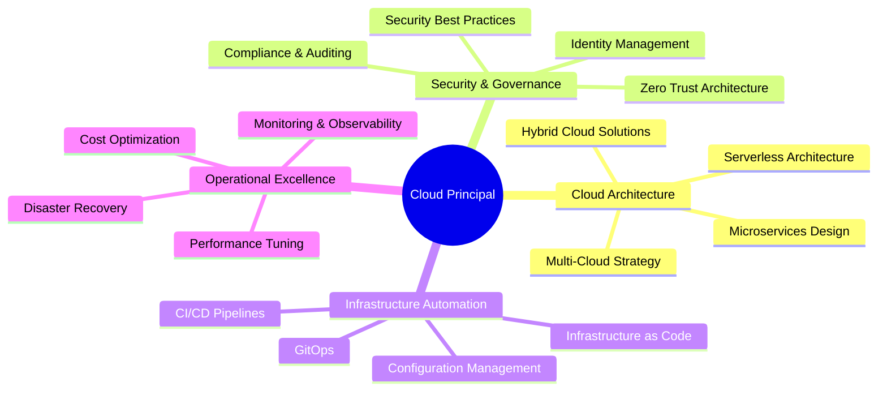

<div align="center">

# 👋 Hey, I'm Peter Mustow
### ☁️ Cloud Principal | Azure Specialist | Cloud Architecture Leader

[](https://www.linkedin.com/in/pmustow/)
[](https://github.com/petermustow)

</div>

---

## 🚀 About Me

As a **Cloud Principal**, I lead cloud transformation initiatives and architect enterprise-scale solutions with a primary focus on **Microsoft Azure**. I'm passionate about driving innovation through cloud technology, infrastructure automation, and DevOps practices. My expertise spans cloud architecture, security, governance, and operational excellence at scale.

- 🏗️ **Cloud Architecture:** Designing and implementing enterprise-grade cloud solutions
- 🔐 **Security & Compliance:** Building secure, compliant cloud infrastructures
- 🤖 **Automation First:** Infrastructure as Code, CI/CD, and DevOps excellence
- 📊 **Strategic Leadership:** Guiding teams and organizations through cloud adoption
- 🌱 **Continuous Learning:** Staying ahead of emerging cloud technologies and best practices

---

## 💼 Core Competencies

### ☁️ Cloud Platforms & Services

<table>
<tr>
<td valign="top" width="50%">

#### Microsoft Azure (Primary)

- **Compute & Containers:** VMs, App Service, AKS, Container Instances
- **Identity & Security:** Entra ID, RBAC, Key Vault, Security Center
- **Networking:** Virtual Networks, Load Balancers, NSGs, Application Gateway
- **Data & AI:** Azure SQL, Cosmos DB, Azure AI Services
- **DevOps:** Azure DevOps, Azure Automation, Azure Monitor
- **Hybrid Cloud:** Azure Arc, Azure Migrate, Azure Stack

</td>
<td valign="top" width="50%">

#### Amazon Web Services

- **Core Services:** EC2, S3, Lambda, VPC
- **Monitoring:** CloudWatch, CloudTrail
- **Security:** IAM, Security Groups
- **Networking:** Route 53, ELB

</td>
</tr>
</table>

### 🛠️ Infrastructure as Code & Automation

```text
Terraform    ████████████████████░  95%
Ansible      ███████████████████░░  90%
Bicep        ██████████████████░░░  85%
ARM          ████████████████░░░░░  80%
PowerShell   ███████████████████░░  90%
Python       ██████████████████░░░  85%
Bash         ███████████████████░░  90%
```


### 🏗️ System Administration & Virtualization

**Operating Systems:**


**Virtualization & Containers:**


### 🌐 Networking & Security

- **Routing Protocols:** EIGRP, OSPF, BGP
- **Network Security:** pfSense, OPNsense, Firewalls, VPNs
- **Cloud Networking:** VNets, VPCs, Load Balancers, NSGs, Security Groups

### 📊 Monitoring & Observability


- **Tools:** Grafana, Prometheus, Azure Monitor, CloudWatch
- **ITSM:** Atlassian Jira & Confulence, Service Now, Data Dog, Zabbix, PagerDuty, Nagios
- **Logging & Analytics:** Application Insights, Log Analytics

### 🔄 DevOps & CI/CD


- **Version Control:** Git, GitHub, Azure Repos
- **CI/CD Pipelines:** GitHub Actions, Azure DevOps Pipelines
- **Containerization:** Docker, Kubernetes
- **Automation:** Jenkins, Azure Automation

---

## 📈 GitHub Stats

<div align="center">


</div>

---

## 🌟 Featured Projects

### [🪟 Winget Installer](https://github.com/petermustow/winget)
Application setup script for automated Windows software deployment using Windows Package Manager.

**Tech Stack:** PowerShell, Windows Package Manager, Automation

---

## 🎯 Areas of Focus



---

## 💡 Cloud Architecture Principles

- ✅ **Design for Failure:** Build resilient, self-healing systems
- 🔒 **Security by Design:** Implement defense-in-depth strategies
- 📈 **Scalability First:** Design for elastic growth and performance
- 💰 **Cost Optimization:** Balance performance with cost efficiency
- 🔄 **Automation Everything:** Reduce manual operations, increase reliability
- 📊 **Observability:** Monitor, measure, and optimize continuously
- 🌍 **Cloud-Native Thinking:** Leverage platform capabilities effectively

---

## 📚 Knowledge Sharing

I believe in continuous learning and knowledge sharing. Some areas I'm passionate about:

- 🏗️ Cloud architecture patterns and best practices
- 🔐 Cloud security and compliance frameworks
- 🤖 Infrastructure automation and DevOps
- 📊 Cloud cost optimization strategies
- 🌐 Hybrid and multi-cloud architectures

---

## 🤝 Let's Connect

I'm always interested in discussing cloud architecture, infrastructure automation, and technology leadership.

[](https://www.linkedin.com/in/pmustow/)
[](https://github.com/petermustow)

---

<div align="center">

### "The best way to predict the future is to build it." ☁️


</div>
