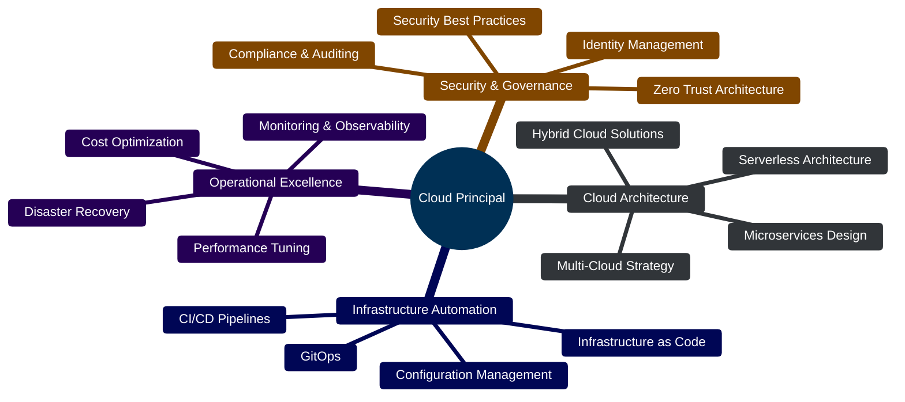

<div align="center">

# 👋 Hey, I'm Peter Mustow
### ☁️ Cloud Principal | Azure Specialist | Cloud Architecture Leader

[](https://www.linkedin.com/in/pmustow/)
[](https://github.com/petermustow)


</div>

---

## 🚀 About Me

As a **Cloud Principal**, I lead cloud transformation initiatives and architect enterprise-scale solutions with a primary focus on **Microsoft Azure**. I'm passionate about driving innovation through cloud technology, infrastructure automation, and DevOps practices. My expertise spans cloud architecture, security, governance, and operational excellence at scale.

- 🏗️ **Cloud Architecture:** Designing and implementing enterprise-grade cloud solutions
- 🔐 **Security & Compliance:** Building secure, compliant cloud infrastructures
- 🤖 **Automation First:** Infrastructure as Code, CI/CD, and DevOps excellence
- 📊 **Strategic Leadership:** Guiding teams and organizations through cloud adoption
- 🌱 **Continuous Learning:** Staying ahead of emerging cloud technologies and best practices

---

## 🔨 Currently Working On

- 🏗️ **Multi-Region Azure Landing Zones** - Implementing enterprise-grade landing zones with Terraform
- 🤖 **GitOps Workflows** - Deploying ArgoCD and Flux for declarative infrastructure
- 📊 **FinOps Framework** - Developing cost optimization practices and governance models
- 🔐 **Zero Trust Architecture** - Building comprehensive security models for hybrid cloud environments
- 🚀 **Platform Engineering** - Creating internal developer platforms with self-service capabilities

---

## 💼 Professional Impact

<div align="center">

| 🏢 Migrations | 💰 Cost Savings | 👥 Teams Led | 🚀 Uptime | 🔒 Security |
|:------------:|:---------------:|:------------:|:---------:|:-----------:|
| **15+ Enterprise** | **40% Average Reduction** | **20+ Engineers** | **99.99% SLA** | **Zero Breaches** |

</div>

- 🌐 Led large-scale cloud transformations across Fortune 500 organizations
- 💡 Architected solutions processing millions of transactions daily
- 📈 Drove adoption of DevOps practices reducing deployment time by 85%
- 🎓 Mentored cloud engineers advancing to senior architect roles

---

## 🎓 Certifications & Credentials

### Microsoft Azure


### Amazon Web Services


### Professional Certifications


---

## 💼 Core Competencies

### ☁️ Cloud Platforms & Services

<table>
<tr>
<td valign="top" width="50%">

#### Microsoft Azure (Primary)

- **Compute & Containers:** VMs, App Service, AKS, Container Instances, Azure Functions
- **Identity & Security:** Entra ID, RBAC, Key Vault, Security Center, Defender
- **Networking:** Virtual Networks, Load Balancers, NSGs, Application Gateway, Front Door
- **Data & AI:** Azure SQL, Cosmos DB, Azure AI Services, Synapse Analytics
- **DevOps:** Azure DevOps, Azure Automation, Azure Monitor, Application Insights
- **Hybrid Cloud:** Azure Arc, Azure Migrate, Azure Stack, Azure VMware Solution

</td>
<td valign="top" width="50%">

#### Amazon Web Services

- **Core Services:** EC2, S3, Lambda, VPC, ECS, EKS
- **Monitoring:** CloudWatch, CloudTrail, X-Ray
- **Security:** IAM, Security Groups, GuardDuty, Secrets Manager
- **Networking:** Route 53, ELB, CloudFront, Direct Connect
- **Database:** RDS, DynamoDB, Aurora

</td>
</tr>
</table>

### 🛠️ Infrastructure as Code & Automation

```text
Terraform    ████████████████████░  95%
Ansible      ███████████████████░░  90%
Bicep        ██████████████████░░░  85%
ARM          ████████████████░░░░░  80%
PowerShell   ███████████████████░░  90%
Python       ██████████████████░░░  85%
Bash         ███████████████████░░  90%
```


### 🧰 Extended Tech Stack

**Cloud Native & Container Orchestration:**


**Security & Compliance:**


**FinOps & Cost Management:**


### 🏗️ System Administration & Virtualization

**Operating Systems:**


**Virtualization & Containers:**


### 🌐 Networking & Security

- **Routing Protocols:** EIGRP, OSPF, BGP
- **Network Security:** pfSense, OPNsense, Firewalls, VPNs, WAF
- **Cloud Networking:** VNets, VPCs, Load Balancers, NSGs, Security Groups, Transit Gateway
- **VoIP & Unified Communications:** SIP, Teams, WebRTC
- **Cisco Technologies:** Switching, Routing, Security Appliances

### 📊 Monitoring & Observability


- **Observability Stack:** Grafana, Prometheus, Loki, Tempo, Jaeger
- **Cloud Monitoring:** Azure Monitor, CloudWatch, Application Insights, Log Analytics
- **ITSM:** GLPI, Centreon, Zabbix, Wazuh, Nagios
- **APM:** Application Insights, Datadog, New Relic

### 🔄 DevOps & CI/CD


- **Version Control:** Git, GitHub, Azure Repos, GitLab
- **CI/CD Pipelines:** GitHub Actions, Azure DevOps Pipelines, Jenkins
- **GitOps:** ArgoCD, Flux, Atlantis
- **Containerization:** Docker, Kubernetes, Podman
- **Automation:** Jenkins, Azure Automation, Rundeck

---

## 📈 GitHub Stats

<div align="center">


</div>

<div align="center">


</div>

<div align="center">

[](https://github.com/petermustow)

</div>

---

## 🌟 Featured Projects

### [🪟 Winget Installer](https://github.com/petermustow/winget)
Application setup script for automated Windows software deployment using Windows Package Manager.

**Tech Stack:** PowerShell, Windows Package Manager, Automation

**Highlights:**
- 🚀 One-command software deployment
- 📦 Package management automation
- ⚙️ Configuration-driven installations

---

## 🎯 Areas of Focus



---

## 🧭 Professional Philosophy

> **"Build with purpose, architect for scale, secure by default, optimize relentlessly."**

### My Core Values

- **🎯 Customer-Centric:** Every architecture decision serves business outcomes
- **📚 Teach to Scale:** Knowledge sharing multiplies impact exponentially
- **⚖️ Pragmatic Innovation:** Balance cutting-edge technology with battle-tested solutions
- **🔒 Security First:** No compromise on security fundamentals
- **💰 Value-Driven:** Cost optimization is architecture, not afterthought
- **🔄 Continuous Improvement:** Systems and skills must evolve together

---

## 💡 Cloud Architecture Principles

- ✅ **Design for Failure:** Build resilient, self-healing systems that embrace chaos
- 🔒 **Security by Design:** Implement defense-in-depth strategies from day one
- 📈 **Scalability First:** Design for elastic growth and performance at scale
- 💰 **Cost Optimization:** Balance performance with cost efficiency through FinOps
- 🔄 **Automation Everything:** Reduce manual operations, increase reliability
- 📊 **Observability:** Monitor, measure, and optimize continuously
- 🌍 **Cloud-Native Thinking:** Leverage platform capabilities effectively
- 🚀 **Developer Experience:** Platform engineering that empowers teams

---

## 🎤 Speaking & Community Engagement

### Conference Talks & Presentations

- 🎙️ **Azure Community Meetups** - Regular speaker on cloud architecture and DevOps
- 📍 **Cloud Architecture Summit** - "FinOps in Practice: Real-World Cost Optimization"
- 📍 **DevOps Days** - "Building Platform Engineering Teams"
- 📍 **Local Tech Meetups** - Monthly presentations on cloud technologies

### Community Involvement

- 👥 **Mentorship:** Active mentor for aspiring cloud architects
- 💬 **Technical Forums:** Regular contributor to Stack Overflow and Azure communities
- 🎓 **Training:** Conducted workshops on Terraform, Kubernetes, and Azure
- 📝 **Knowledge Base:** Building comprehensive cloud architecture documentation

---

## 📝 Latest Blog Posts & Articles

### Recent Publications

- 📄 **[Building Resilient Cloud Architectures](https://example.com)** - Best practices for high availability
- 📄 **[Terraform Best Practices for Enterprise](https://example.com)** - Scaling IaC across organizations
- 📄 **[FinOps: Making Cloud Cost Everyone's Concern](https://example.com)** - Cultural shift in cost management
- 📄 **[Zero Trust in Hybrid Cloud](https://example.com)** - Security architecture patterns
- 📄 **[Platform Engineering 101](https://example.com)** - Building internal developer platforms

### Topics I Write About

- 🏗️ Cloud architecture patterns and anti-patterns
- 🔐 Cloud security and compliance frameworks
- 🤖 Infrastructure automation and GitOps workflows
- 📊 Cloud cost optimization and FinOps strategies
- 🌐 Hybrid and multi-cloud architectures
- 🚀 Platform engineering and developer experience

---

## 📚 Recommended Resources

### Essential Books

- 📖 **"Cloud FinOps"** - J.R. Storment & Mike Fuller
- 📖 **"Kubernetes Patterns"** - Bilgin Ibryam & Roland Huß
- 📖 **"The Phoenix Project"** - Gene Kim
- 📖 **"Site Reliability Engineering"** - Google
- 📖 **"Infrastructure as Code"** - Kief Morris

### Tools Worth Exploring

**Infrastructure & Automation:**
- [Terraform](https://terraform.io) - Infrastructure as Code
- [Pulumi](https://pulumi.com) - Modern IaC with familiar languages
- [Ansible](https://ansible.com) - Configuration management

**Security & Compliance:**
- [Checkov](https://checkov.io) - IaC Security Scanning
- [Trivy](https://trivy.dev) - Container security scanner
- [Prowler](https://prowler.pro) - Cloud security assessment

**Cost Optimization:**
- [Infracost](https://infracost.io) - Cloud cost estimation in CI/CD
- [Kubecost](https://kubecost.com) - Kubernetes cost monitoring
- [Cloud Custodian](https://cloudcustodian.io) - Cloud governance

**GitOps & Platform:**
- [ArgoCD](https://argo-cd.readthedocs.io) - Declarative GitOps
- [Flux](https://fluxcd.io) - GitOps toolkit
- [Backstage](https://backstage.io) - Developer portal platform

---

## 📬 Contact & Availability

### Let's Connect!

I'm always interested in discussing cloud architecture, infrastructure automation, and technology leadership.

[](https://www.linkedin.com/in/pmustow/)
[](https://github.com/petermustow)
[](mailto:contact@example.com)

### Open To

- 💼 **Architecture Reviews** - Review and optimize your cloud architecture
- 🎤 **Speaking Opportunities** - Conferences, meetups, podcasts
- 🤝 **Consulting Projects** - Enterprise cloud transformations
- 👨‍🏫 **Mentorship** - Helping cloud professionals level up
- 📝 **Technical Writing** - Guest posts and collaborative content

---

## ⚡ Fun Facts

- 🎮 When not architecting clouds, I'm building Minecraft servers (infrastructure everywhere!)
- ☕ Coffee consumption scales linearly with infrastructure complexity
- 🏃 Marathon runner - endurance in code and in life
- 📚 Read 50+ tech books annually and counting
- 🌍 Visited 12 AWS regions (personally, not just my code!)
- 🎸 Play guitar - debugging is just another form of troubleshooting chords
- 🌱 Homelab enthusiast with a rack that rivals small datacenters

---

## 🏆 Success Stories & Case Studies

### 🚀 Global E-Commerce Platform Migration

**Challenge:** Migrate legacy monolithic application to cloud-native microservices
**Solution:** Implemented Azure AKS with Istio service mesh, full CI/CD automation with GitHub Actions
**Results:**
- 💰 60% infrastructure cost reduction
- 📈 99.99% uptime achievement
- ⚡ 10x deployment frequency increase
- 🔒 Zero-downtime migration

### 🏢 Multi-Cloud Governance Framework

**Challenge:** Standardize security and compliance across Azure and AWS estates
**Solution:** Policy-as-Code using Terraform, Azure Policy, and AWS Service Control Policies
**Results:**
- ✅ 100% compliance across all cloud resources
- 🤖 Automated remediation reducing manual effort by 90%
- 📊 Audit-ready posture with complete traceability
- 🔐 Unified security baseline across clouds

### 💰 Enterprise FinOps Implementation

**Challenge:** Uncontrolled cloud spend across 200+ subscriptions
**Solution:** Implemented comprehensive FinOps practice with tagging strategy, cost allocation, and showback
**Results:**
- 📉 40% reduction in overall cloud spend
- 👁️ 100% cost visibility and accountability
- 🎯 Chargeback model driving behavior change
- 📊 Executive dashboards for data-driven decisions

---

<div align="center">

### "The best way to predict the future is to build it." ☁️

---


**Made with ❤️ and lots of ☕**

</div>
